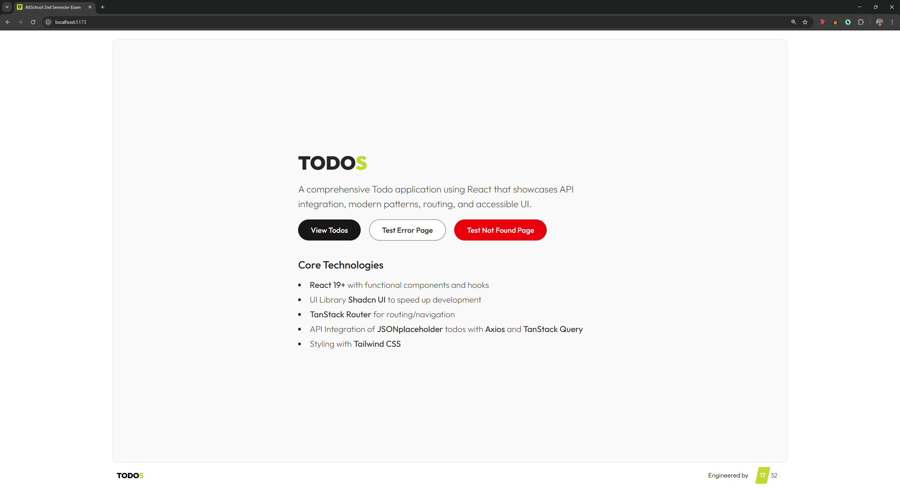
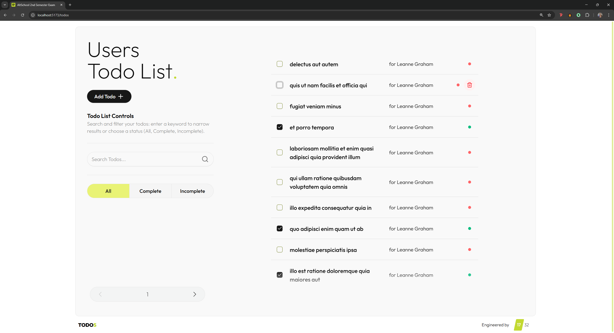
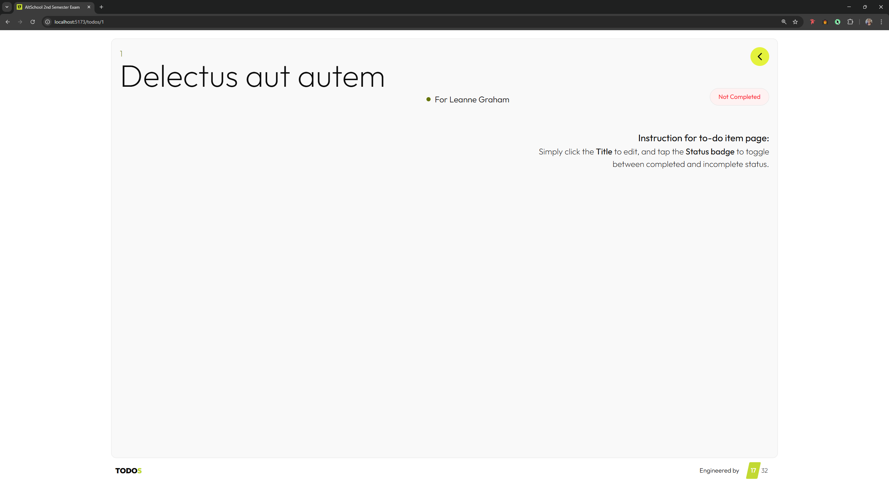
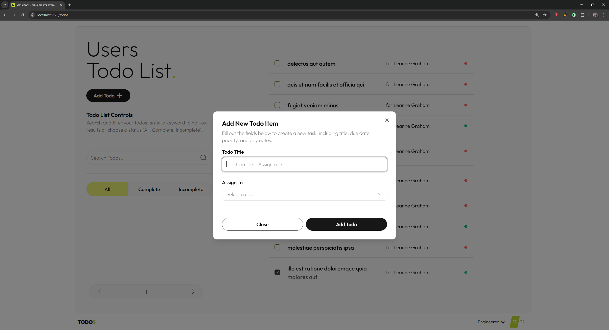
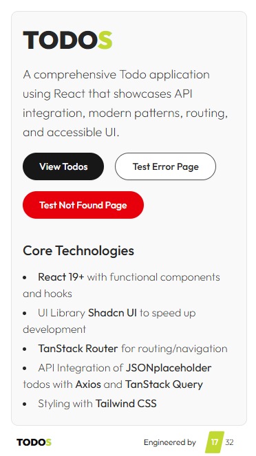
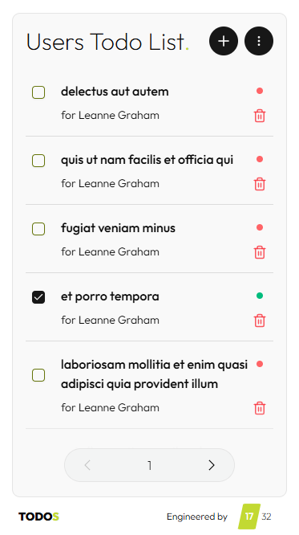
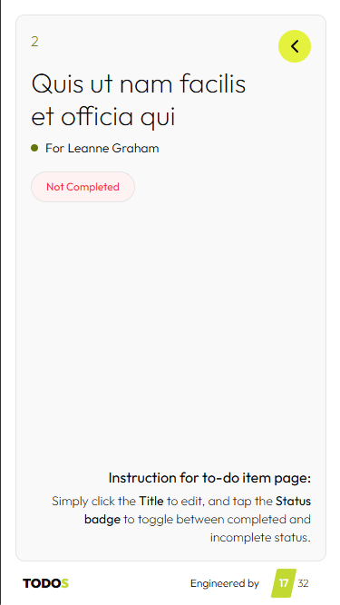
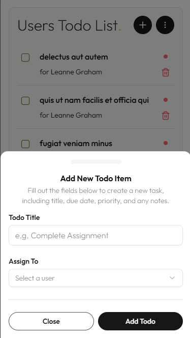
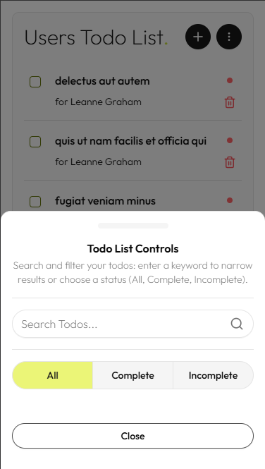

# TODOS

A comprehensive Todo application using React that demonstrates frontend engineering skills. This project showcases ability to work with APIs, implement modern React patterns, handle routing, and create accessible user interfaces.

## 🚀 Features

### Core Functionality

- ✅ **Create, Read, Update, Delete (CRUD) Operations** - Full todo management
- 🔍 **Advanced Search** - Real-time search across todo titles
- 🎯 **Smart Filtering** - Filter by completion status (All, Completed, Incomplete)
- 📄 **Pagination** - Efficient handling of large todo lists
- 👥 **User Management** - Associate todos with specific users
- 🎨 **Modern UI** - Clean, responsive design with Tailwind CSS

### Technical Features

- ⚡ **Optimistic Updates** - Instant UI feedback for better UX
- 🔄 **Real-time Sync** - Background data synchronization
- 📱 **Responsive Design** - Mobile-first approach
- 🎭 **Loading States** - Skeleton loaders and smooth transitions
- 🚨 **Error Handling** - Comprehensive error boundaries and user feedback
- 🔗 **Type-safe Routing** - File-based routing with TanStack Router

## 🛠️ Technology Stack

### Frontend

- **React 19** - Modern React with hooks and concurrent features
- **TanStack Router** - Type-safe file-based routing
- **TanStack React Query** - Server state management and caching
- **Tailwind CSS** - Utility-first CSS framework
- **Shadcn UI** - Beautiful customizable UI Library

### Architecture Patterns

- **Component-Based Architecture** - Modular, reusable components
- **Custom Hooks** - Encapsulated business logic
- **Server State Management** - Separation of client and server state
- **Error Boundaries** - Graceful error handling
- **Optimistic UI Updates** - Enhanced user experience

## 📦 Installation and Setup

### Prerequisites

- Node.js 18.0 or higher
- npm package manager

### Installation Steps

1. **Clone the repository**

   ```bash
   git clone https://github.com/AJ1732/altSchool-tinyuka-2024--2nd-semester-exam.git
   cd altSchool-tinyuka-2024--2nd-semester-exam
   ```

2. **Install dependencies**

   ```bash
   npm install
   ```

3. **Environment Setup**
   Create a `.env` file in the root directory:

   ```env
   VITE_JSON_TODOS_URL=https://jsonplaceholder.typicode.com
   ```

4. **Start the development server**

   ```bash
   npm run dev
   ```

5. **Open your browser**
   Navigate to `http://localhost:5173`

## 🏗️ Project Structure

```
src/
├── components/
│   ├── layout/          # Layout components (Header, Footer)
│   ├── shared/          # Reusable components (ErrorBoundary, NotFound)
│   ├── todos/           # Todo-specific components
│   └── ui/              # Base Shadcn UI components (Button, Input, etc.)
├── config/
│   ├── api.js           # API configuration and endpoints
│   └── queries.js       # React Query hooks and configurations
├── hooks/               # Custom React hooks
├── lib/
│   ├── axios.js         # Axios Instance
│   └── utils.js         # clsx and tailwind-merge utility cn() function
├── routes/              # File-based routing structure
├── utils/               # Helper functions and utilities
├── index.css            # Global styles and Tailwind imports
└── main.jsx            # Application entry point
```

## 🔌 API Documentation

### Base Configuration

The application uses JSONPlaceholder as a mock backend API. All API calls are configured in `src/config/api.js`.

**Base URL:** `https://jsonplaceholder.typicode.com`

### Available Endpoints

#### Todos

- `GET /todos` - Fetch all todos with optional query parameters
- `GET /todos/:id` - Fetch a specific todo
- `POST /todos` - Create a new todo
- `PUT /todos/:id` - Update an existing todo
- `PATCH /todos/:id` - Update an existing todo
- `DELETE /todos/:id` - Delete a todo

#### Users

- `GET /users` - Fetch all users
- `GET /users/:id` - Fetch a specific user

### Query Parameters

| Parameter    | Type    | Description                 |
| ------------ | ------- | --------------------------- |
| `_page`      | number  | Page number for pagination  |
| `_limit`     | number  | Number of items per page    |
| `completed`  | boolean | Filter by completion status |
| `title_like` | string  | Search query for title      |
| `userId`     | number  | Filter by user ID           |

## 📱 Screenshots

### Main Todo Page


_Main interface showing todos with filtering and pagination_

### Main Todo List


_Main interface showing todos with filtering and pagination_

### Single Todo Page


_Main interface showing single todo interface_

### Add Todo Modal


_Modal interface for creating new todos_

### Mobile Responsive View






_Responsive design on mobile devices_

## 🐛 Known Issues

- **API Limitations**: Using JSONPlaceholder means some CRUD operations are simulated
- **Offline Support**: No offline functionality currently implemented
- **Advanced Filtering**: Date-based filtering not yet implemented
- **Bulk Operations**: No bulk select/delete functionality

## 🔮 Future Improvements

- [ ] **Backend Integration** - Custom API with authentication
- [ ] **Drag & Drop Reordering** - Reorder todos by priority
- [ ] **Bulk Actions** - Select multiple todos for batch operations
- [ ] **Due Dates** - Add date picker and deadline management
- [ ] **Categories/Tags** - Organize todos with custom tags
- [ ] **Dark Mode** - Theme switching capability
- [ ] **Offline Support** - offline functionality
- [ ] **Real-time Collaboration** - WebSocket integration
- [ ] **Keyboard Shortcuts** - Power user navigation

---

_Engineered by 1732_
